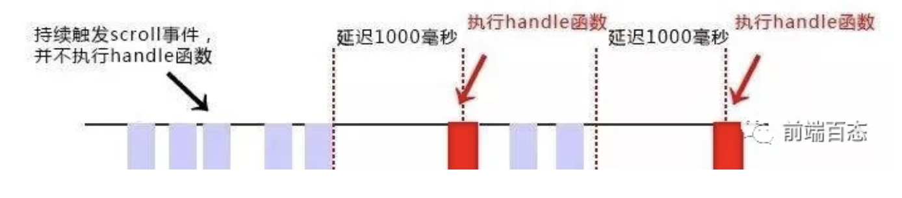
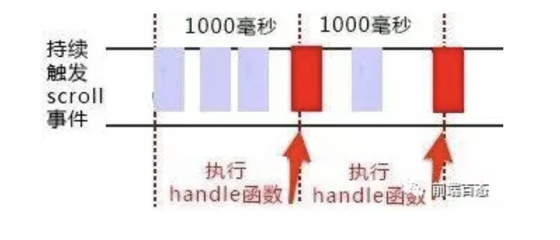

# js原生实现 防抖 节流

## 防抖（debounce）
**定义**：在事件被触发n秒后再执行回调函数，如果在这n秒内又被触发，则重新计时。

**用途**：鼠标多次点击事件，输入框内容校验或搜索等操作时，如果事件处理函数调用的频率无限制，会加重浏览器的负担，导致用户体验非常糟糕。

**举例**：例如张三在6:10进入电梯，正常电梯停留5分钟即6:15关门，但在6:13时李四又按了电梯随后走进了电梯，那么电梯会在6:18正常运行。

 

### scroll滚动事件
当持续触发scroll事件时，事件处理函数handle只在**停止滚动**1000毫秒之后才会调用一次，即在持续触发scroll事件的过程中，事件处理函数handle一直没有执行。
```js
// 防抖函数
function debounceFunc(fn, delay) {
    let timeout = null;
    
    return function() {
        if(timeout) clearTimeout(timeout);
        timeout = setTimeout(fn, delay);
    }
}

// 处理函数
function handle() {
    console.log(Math.random());
}

// 滚动事件
window.addEventListener('scroll', debounceFunc(handle, 1000));
```

### Input搜索事件
使用input搜索关键字调接口时，如果不做任何处理，键盘每按下一次就会发一次请求；如果使用了防抖，
会在停止敲入键盘的指定时间之后再去调接口，这样可以有效减少请求次数，节约请求资源。
```js
<body>
    <input id="name" type="text" οnkeyup="ajax">
    <script>
    // 模拟ajax请求
    function ajax(e) {
        console.log(e.target.value);
        // this.props.ajax.post('/getParams', params);
    }

    // 防抖函数
    function debounceFunc(fun, delay) {
        let timer = null;

        return function (arguments) {
            // 获取函数的作用域和变量
            let that = this;
            let args = arguments;

            // 清除定时器
            if(timer) clearTimeout(timer);

            timer = setTimeout(function () {
                // call方法第一个参数确定新的this指向，后面可以有多个参数是一串参数列表
                fun.call(that, args)
            }, delay)
        }
    }

    const name = document.getElementById('name');

    name.addEventListener('input', debounceFunc(ajax, 2000));
    </script>
</body>
```

## 节流（throttle）
**定义**：规定一个单位时间，在这个单位时间内，只能有一次触发事件的回调函数被执行，如果在同一个单位时间内某事件被触发多次，**只有一次会生效**。

**用途**：监听浏览器窗口的resize事件，监听是否滚动到底部（自动加载更多）事件。

**举例**：例如张三在6:10进入电梯，正常电梯停留5分钟即6:15关门，6:13时李四又按了电梯随后走进了电梯，但电梯都会在6:15正常运行。

**分类**：函数节流主要有两种实现方法，**时间戳**和**定时器**



### 时间戳
**特点**：当高频事件触发时，**第一次会立即执行**，但最后一次触发后事件不会再被执行。
```js
// 节流函数
function throttle(func, delay) {
　　let prev = Date.now();
　　
　　return function() {
　　　　let context = this;
　　　　let args = arguments;
　　　　let now = Date.now();
　　　　
       // 第一次会立即执行，因为事件绑定函数的时间 - 真正触发事件的时间 一般 >= delay
       // 而后再怎么频繁地触发事件，也都是每delay时间才执行一次；
　　　　if (now - prev >= delay) {
　　　　　　func.apply(context, args);
          // 最后一次事件触发完毕后，事件也不会再被执行了
          // 因为最后一次触发事件与倒数第二次触发事件的 间隔 一定小于 delay，如果大于的话就不叫高频事件了
　　　　　　prev = Date.now();  
　　　　}
　　}
}

// 处理函数
function handle() {
　　console.log(Math.random());
}

// 滚动函数
window.addEventListener('scroll', throttle(handle, 1000));
```

### 定时器
**特点**：当第一次触发事件时，不会立即执行函数；**但最后一次会被执行**。
```js
// 节流函数
function throttle(func, delay) {
    let timer = null;
    
    return function() {
        let context = this;
        let args = arguments;
        
        // 第一次还没有生成计时器，所以第一次不会执行。
        if (!timer) {
            timer = setTimeout(function() {
                func.apply(context, args);
                // 当最后一次停止触发后，由于还存在上一次设置的最后一个定时器，经过delay时间后还会执行一次函数。
                timer = null;
            }, delay);
        }
    }
}

// 处理函数
function handle() {
    console.log(Math.random());
}

// 滚动函数
window.addEventListener('scroll', throttle(handle, 1000));
```

### 时间戳 + 定时器
**特点**：当触发高频时间后，**第一次会立即执行**，**最后一次也会执行**。
```js
// 节流函数（时间戳+定时器）
function throttle(func, delay) {     
    let timer = null;     
    let startTime = Date.now();     
    
    return function() {             
        const curTime = Date.now(); 
        // 使用开始时间startTime、当前时间curTime与delay来计算剩余时间remaining
        const remaining = delay - (curTime - startTime);         
        let context = this;             
        let args = arguments;             
        
        // 如果在remaining这段时间中又一次触发事件，那么会取消当前的计时器，并重新计算一个remaining来判断当前状态
        clearTimeout(timer);              
        
        // 当remaining<=0时表示该执行事件处理函数了，保证了第一次触发事件就能立即执行事件处理函数。
        // 因为通过上面计算公式，第一次时remaining一定是小于0的
        if (remaining <= 0) {                    
            func.apply(context, args);                    
            startTime = Date.now();              
        } else { 
            // 如果还没到时间的话就设定在remaining时间后再触发
            // 保证了最后一次触发事件后还能再执行一次事件处理函数
            timer = setTimeout(func, remaining);              
        }      
    }
}

// 处理函数
function handle() {      
    console.log(Math.random());
} 

// 滚动函数
window.addEventListener('scroll', throttle(handle, 1000));
```
