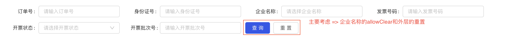

# Antd select远程搜索封装
封装主要考虑了，当搜索框置于其它父级组件时，并且父级组件带有**重置**功能时。
 
## 图片示例 


## 组件封装

### 搜索组件(企业名称)
```js
import React, {Component, Fragment} from 'react';
import {Form, message, Spin} from 'antd';
import config from '@/commons/config-hoc';
import debounce from 'lodash/debounce';
import {
    FormElement,
} from '@/library/components';

@config({
    ajax: true,
})
@Form.create()
export default class index extends Component {
    constructor(props) {
        super(props);
        this.lastFetchId = 0;
        this.fetchUser = debounce(this.fetchUser, 200);
    }

    state = {
        data: [],
        value: [],
        fetching: false,
        isReset: false,
    };

    // 判断props与当前stats是否相同，不同时代表父级点击了重置按钮，所以用setFieldsValue
    static getDerivedStateFromProps(nextProps, prevState) {
        if (prevState.isReset !== nextProps.isReset) {
            nextProps.form.setFieldsValue({"companyNo": []});

            return {
                isReset: nextProps.isReset,
            };
        }

        return null;
    }

    fetchUser = value => {
        this.lastFetchId += 1;

        const fetchId = this.lastFetchId;

        this.setState({data: [], fetching: true});
        this.props.ajax.get(`/company/info?companyName=${value}`)
            .then(res => {
                if (fetchId !== this.lastFetchId) return;

                const data = res?.data.map(it => ({
                    label: it.companyName,
                    value: it.companyNo,
                }));
                this.setState({data});
            })
            .finally(() => this.setState({fetching: false}));
    };

    handleChange = value => {
        // message.success('请点击查询进行检索！');

        value && this.props.showValue(value);
        this.setState({
            value,
            data: [],
            fetching: false,
        });
    };

    limitValueCount = (rule, value, callback) => {
        const {setFieldsValue} = this.props.form;

        if (value.length > 1) {
            setFieldsValue({
                "companyNo": value[value.length - 1],
            });
        }

        callback();
    };

    render() {
        const {form, width, labelWidth, isRequired, isFocus, isClear} = this.props;
        const {fetching, data, value} = this.state;
        const formProps = {
            form,
            width: width,
            labelWidth: labelWidth,
            style: {paddingLeft: 16},
        };
        
        // 主要考虑onFocus事件，聚焦时通知父组件，让父组件改变isReset的状态
        return (
            <Fragment>
                <FormElement
                    {...formProps}
                    type="select"
                    label="企业名称"
                    field="companyNo"
                    mode="multiple"
                    initialValue={value}
                    labelInValue={true}
                    notFoundContent={fetching ? <Spin size="small"/> : null}
                    filterOption={false}
                    onSearch={this.fetchUser}
                    
                    onChange={this.handleChange}
                    onFocus={() => isFocus && isFocus()}
                    clearIcon={<Icon type='close-circle' onClick={() => isClear && isClear()} />}

                    rules={[this.limitValueCount]}
                    options={data}
                    required={isRequired}
                />
            </Fragment>
        );
    }
}
```

### 父组件(带有重置按钮的组件)
```js
export default class PayManage extends Component {
    state = {
        isReset: false,
    }

    // 公司名称 子组件 传过来的值
    companyNo = '';
    handleShowValue = (value) => {
        this.companyNo = value || '';
    };
    
    render() {
        // 主要考虑重置和点击allowClear时将 this.companyNo 设置为空
        return {
            <CompanySearch 
                width={280} 
                labelWidth={70} 
                showValue={this.handleShowValue} 
                isFocus={() => this.setState({isReset: false})}
                isClear={() => this.companyNo = ''} 
                isReset={isReset}
            />
            
            <FormElement layout width="auto">
                <Button type="primary" htmlType="submit">查询</Button>
                <Button onClick={() => this.setState({isReset: true}, () => {
                    form.resetFields();
                    this.companyNo = '';
                })}>重置</Button>
            </FormElement>
        }       
    }
}
```
