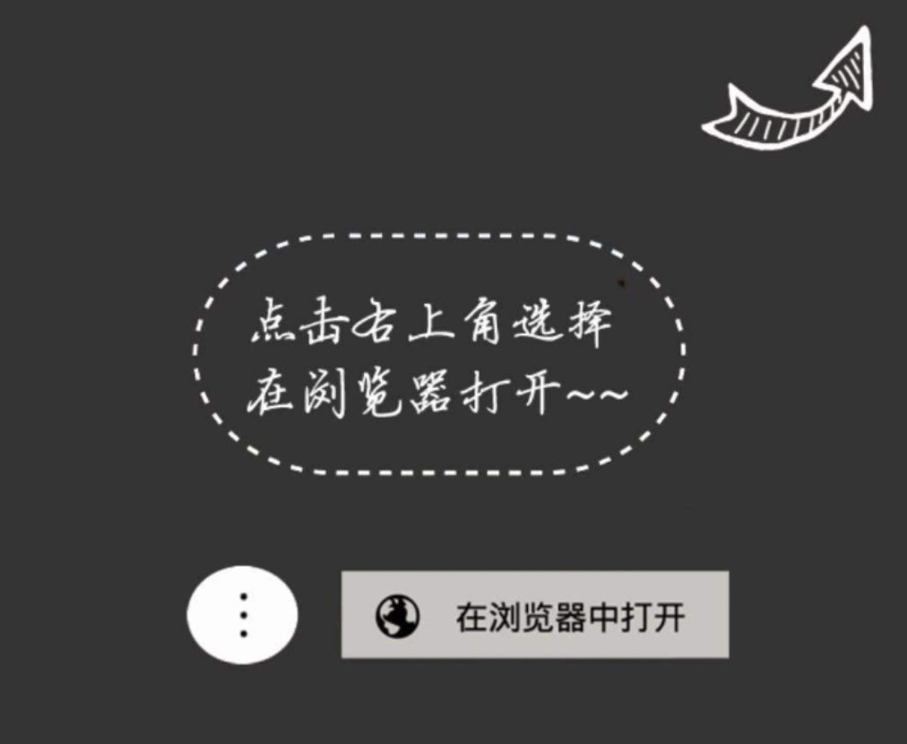

# 微信公众号开发
记录微信公众号开发网页中遇到的问题。

## 开发前准备
1. 申请微信测试号，并添加自定义菜单。https://mp.weixin.qq.com/debug/cgi-bin/sandboxinfo?action=showinfo&t=sandbox/index 
2. 登陆微信公众号后台，配置后台服务器信息。开发 => 基本配置

## 开始开发
只设计微信授权等方面。

### 获取微信授权  
1. 前端需要根据appid和redirect_uri去获取code。
2. 然后把code传给后台，后台会根据这个code请求微信的接口然后把openId返给前端。
```js
// 自定义菜单时会指明一个网页链接，这个网页链接中的内容如下
window.location.replace(`https://open.weixin.qq.com/connect/oauth2/authorize?appid=wxfec6634c0e8ebc3f&redirect_uri=https://hntx-h5.hntxtd.com/mobile/signAjax.html&response_type=code&scope=snsapi_userinfo&state=STATE#wechat_redirect`);
// redirect_uri：重定向的网址，这个网址是前端的页面链接
// scope：有两个取值snsapi_userinfo(需要通过用户手动授权，即弹出授权框)、snsapi_base(静默授权，即不弹出授权框，默认能够拿到用户的信息)
// #wechat_redirect：这个参数一定要加，通知微信授权的标志。
```
```js
// 上面代码块指定的redirect_uri，是前端本地的一个页面。在这个页面的url参数中可以拿到微信返给我们的code
if(window.location.search.includes('code')) {
    const code = window.location.search.split('=')[1].split('&')[0];
    
    $.ajax({
        type: 'GET',
        url: `/api/wechat/getOpenId?code=${code}`, // 后台接口地址
        success: function (res) {
            // openId是我们需要的，可以用openId请求后台的接口
            const {openId} = res.data || {};
            
            $.ajax({
                type: 'GET',
                url: `/api/sign/user/findByWechatId?wechatId=${openId}`,
                success: res => {
                    // TODO 拿到用户的信息做一些操作
                }
            })
        }
    });
}
```

### 关于下载链接
处理pdf文件时，ios会直接预览，android则会默认去下载dpf，但是android下载的时候，微信内置浏览器基于
安全策略不允许用户在微信浏览器里下载，所以需要引导用户去打开手机浏览器下载。

**detail.html**
```html
<a onclick="handleJump('${it.contractLink}')">合同详情</a>
```
```js
function handleJump(link) {
    window.location.href = `guide.html?fileUrl=${link}`;
}
```

**guide.html**



```js
<style>
    .guide {
        width: 100vw;
        height: 100vh;
        background: #343434;
        display: block;
    }

    .guide-img {
        width: 100%;
        margin-top: 1rem;
    }
</style>

<div class="guide" id="guide">
    
</div>

<script>
    function GetRequest() {
        const url = location.search; // 获取url中"?"符后的字符串
        const theRequest = {};
    
        if (url.indexOf("?") !== -1) {
            const str = url.substr(1);
            const strs = str.split("&");  //字符串分割
    
            for (let i = 0; i < strs.length; i++) {
                theRequest[strs[i].split("=")[0]] = (strs[i].split("=")[1]);
            }
        }
    
        return theRequest;
    }
    
    //判断是否是微信浏览器
    function is_weixin() {
        const ua = window.navigator.userAgent.toLowerCase();
        
        return ua.match(/MicroMessenger/i) === 'micromessenger'; // 为true则代表是微信内置浏览器
    }
    
    if (is_weixin()) {
        // 是微信浏览器 （用户选择浏览器中打开）
    } else {
        //不是微信浏览器 执行下载
        setTimeout(() => {
            window.location.href = GetRequest().fileurl;
        }, 500);
    }
</script>
```

## 项目上线
项目上线必须要认证公众号。主要是一些微信公众号后台的配置。

1. 设置 => 公众号设置 => 功能设置 => Js接口安全域名。这个域名是前端部署的域名，表示该域名下的页面可调用微信开放的JS接口。
2. 设置 => 安全中心 => ip白名单。白名单中配置后台服务器的ip地址，否则后台接口无法调用微信的接口。

## 开发中遇到的困难
1. 关于授权：**前端能做的就是通过appid调用微信的接口，然后在redirect_uri指定的页面去截取url中的code，前端只管拿到code就可以了**，
    至于获取openId等操作，因为微信的安全策略，不允许暴露在前端，所以openId等一定是后端去获取的。

2. 关于页面缓存问题：在后期测试的时候，发现已经部署了新的代码，但测试手机上的网页还是之前的代码，原来是微信微信内置浏览器对网页的
    缓存策略，经查阅，**需要将nginx静态文件缓存时间改成0，如果还不行的话，就需要测试手机退出微信，重新登陆就可以了**。

