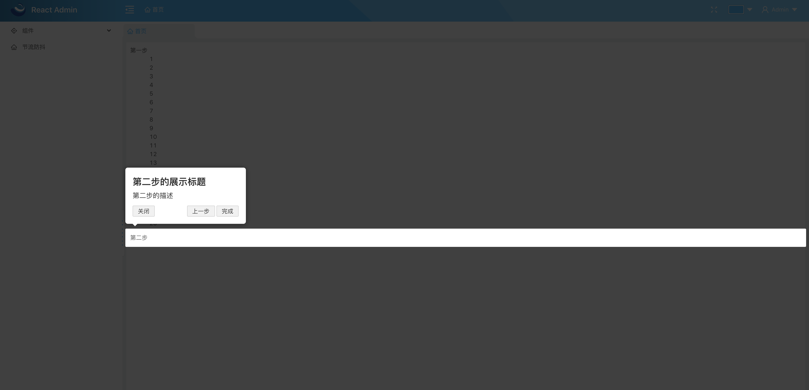

# 步骤（新手）指引
github: https://github.com/kamranahmedse/driver.js

## 安装
```js
yarn add driver.js --save
```

## 图片演示


## 项目例子
应用场景：步骤（新手）指引。
```js
import Driver from 'driver.js';
import 'driver.js/dist/driver.min.css';

componentDidMount() {
    // 通用配置 只列举了常用的 
    const driver = new Driver({
        allowClose: false, // 点击遮罩层是否允许关闭 默认为true
        doneBtnText: '完成',
        closeBtnText: '关闭',
        nextBtnText: '下一步',
        prevBtnText: '上一步',
        padding: 10, 
        stageBackground: '#ffffff', // 弹出框背景色 
    });

    // driver.defineSteps([
    //     stepDefinition1,
    //     stepDefinition2,
    // ]);
    driver.defineSteps([
        {
            element: '#ele1', // 获取的元素，即要将步骤提示加到该元素上
            popover: {
                title: '第一步的展示标题', // title, description 也可以使用 HTML
                description: '第一步的描述',
                offset: 20, // 偏移量
            },
            onNext: () => {
                driver.preventMove(); // 停止下一步操作
                
                // 即 过 500s 在跳到下一步
                setTimeout(() => {
                    driver.moveNext();
                }, 500);
            }
        },
        {
            element: '#ele2',
            popover: {
                title: '第二步的展示标题',
                description: '第二步的描述',
                position: 'bottom', // 弹出框展示的位置 默认上方
            },
            onPrevious: () => {}, // 点击上一步按钮
        }
    ]);
    
    // 方法API
    driver.start(); // start()接收number类型参数，默认为0,即数组下标，driver.start(1) => 从第二步开始
    driver.getHighlightedElement(); // 当前在第几步
    driver.getLastHighlightedElement(); // 最后到了第几步
    driver.refresh(); // 重新定位弹出窗口和突出显示的元素
    driver.reset(); // 重置覆盖层并清除屏幕
}
```
