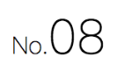
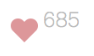
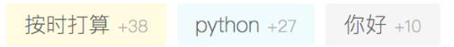
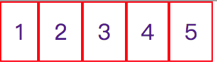

# display属性的常见应用

## display: flex (盒模型)
盒模型的知识点比较多，慢慢补充～

### align-items: baseline
垂直方向上以基线对齐。可以编写日历、字体大小不一但需要对齐等样式。


```html
<div class="box">
    <div class="one">No.</div>
    <div class="two">08</div>
</div>
```
```css
.box {
    display: flex;
    align-items: baseline;
}

.one {
    font-size: 12px;
}

.two {
    font-size: 24px;
}
```

## display: inline-flex
将对象作为内联块级弹性伸缩盒显示，可以与display: flex区分记忆。

声明display: flex的元素，宽度默认为100%；声明display: inline-flex的元素，宽度会根据子元素的宽度自适应；

所有当封装一个组件时，我们往往希望这个组件有自己的宽高，以便和其他组件一起布局。

   
```css
.container {
    display: inline-flex;
}

img {
    width: 32px;
    height: 28px;
}

.text {
    font-size: 12px;
    color: #bbbbbb;
    position: relative;
    bottom: 10px;
}
```

## display: inline-block
设置了inline-block属性的元素既具有block元素可以设置width和height属性的特性，又保持了inline元素不换行的特性.

做横向导航菜单的时候一般结构是 ul > li > a。

我们可以给li设置inline-block，**但需要注意的是设置inline-block的元素之间会产生空隙**。


```css
* li, a {
    padding: 0;
    margin: 0;
    list-style: none;
    text-decoration: none;
}

ul {
    /* 给父元素设置display: table 可消除子元素产生的间隙 */
    display: table; 
}

li {
    display: inline-block;
    border: 1px solid red;
    padding: 10px;
}
```


