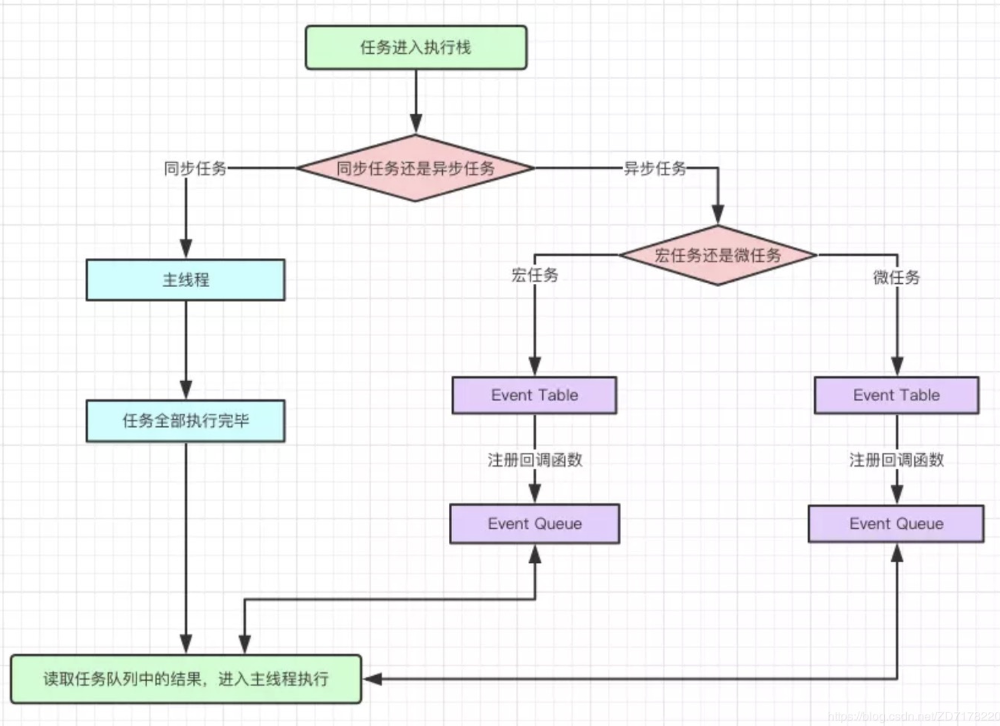

# js执行机制
JS是单线程语言，JS的事件循环（Event Loop）是JS的执行机制。

## 需要知道的三点   
> JS为什么是单线程的?

    JS最初被设计用在浏览器中，如果浏览器中的JS是多线程的；
    
    那么假如有一个线程process1想要删除dom，而另外一个线程process2想要编辑dom；
    
    同时两个矛盾的操作，浏览器就不知道该怎么执行了，所以说js被设计成单线程。
> 为什么需要异步?

    如果JS只能自上而下执行，不存在异步；
    
    那么上一行解析时间很长，那么下面的代码就会被阻塞；
    
    对于用户而言，阻塞就意味着"卡死"，这样就导致了很差的用户体验，所以JS中存在异步执行。
> 单线程如何实现异步?

    通过事件循环（Event Loop），了解了事件循环的原理就了解了js执行机制。

## 事件循环（Event Loop）
> 为什么要区分同步任务、异步任务、宏任务、微任务?
    
    同步、异步、宏任务、微任务分别是函数几个不同维度的描述。
    
    异步任务：setTimeout和setInterval、ajax、事件绑定等
    
    同步任务：除了异步任务外的所有任务
    
    微任务：process.nextTick 和 Promise后的then语句和catch语句等
    
    宏任务：整体代码script、setTimeOut、setInterval 
    
### 执行顺序
先同步再异步，**在此基础上先宏任务再微任务**。

 

1. 整体的script开始执行的时候，会把所有代码分为同步任务、异步任务；
2. 同步任务会直接进入主线程依次执行；
3. 异步任务会再分为宏任务和微任务；
4. 宏任务进入到Event Table中，宏任务是一个一个执行的，并在里面注册回调函数，每当指定的事件完成时，Event Table会将这个函数移到Event Queue中；
5. 微任务也会进入到另一个Event Table中，并在里面注册回调函数，每当指定的事件完成时，Event Table会将这个函数移到Event Queue中；
6. 当主线程内的任务执行完毕，**主线程为空时，会检查微任务的Event Queue，如果有微任务，就全部执行，如果没有就执行下一个宏任务**；
7. 上述过程会不断重复，这就是Event Loop事件循环；

### 案例说明
案例会结合上面流程图，由浅入深。

#### 案例1
```js
setTimeout(function(){
    console.log('定时器开始')
});
new Promise(function(resolve){
    console.log('Promise开始');
    resolve();
}).then(function(){
    console.log('第一个then')
}).then(function() {
    console.log('第二个then')
})
console.log('代码执行结束');

// Promise开始
// 代码执行结束
// 第一个then
// 第二个then
// 定时器开始

// 步骤分析，=> 会对应执行顺序中的7步。
// => 4 （1）setTimeout是异步任务并且属于宏任务，放到宏函数队列中，等待下次Event Loop才会执行
// => 2 （2）new Promise是同步任务，直接执行，输出 Promise开始
// => 5 （3）promise.then是微任务，将两个then放到微任务队列中
// => 2 （4）遇到console同步任务，直接执行，输出 代码执行结束
// => 6 （5）检查微任务队列，发现微任务中有then语句，则全部执行，依次输出 第一个then 第二个then
// => 4 （6）主线程执行完毕，没有微任务，那么执行新一轮宏任务setTimeout，输出 定时器开始
```

#### 案例2
```js
setTimeout(function() { // timer1
  console.log(1);
  setTimeout(function() {  // timer3
    console.log(2);
  })
}, 0);
setTimeout(function() {  // timer2
  console.log(3);
}, 0);

// 1 3 2

// 步骤分析，=> 会对应执行顺序中的7步。
// => 4 (1) 第一个setTimeout是异步任务且宏函数，记做timer1放到宏函数队列；
// => 4 (2) 第三个setTimeout是异步任务且宏函数，记做timer2放到宏函数队列；
// => 6 (3) 没有微任务，第一次Event Loop结束；
// => 2 (4) 取出timer1，console.log(1)同步任务，直接执行，打印1；
// => 4 (5) timer1里面的setTimeout是异步任务且宏函数，记做timer3放到宏函数队列；
// => 6 (6) 没有微任务，第二次Event Loop结束；
// => 2 (7) 取出timer2，console.log(3)同步任务，直接执行，打印3；
// => 6 (8) 没有微任务，第三次Event Loop结束；
// => 2 (9) 取出timer3，console.log(2)同步任务，直接执行，打印2；
// => 6 (10) 没有微任务，也没有宏任务，第四次Event Loop结束；
```

#### 案例3
根据案例2改编，**宏任务例如setTimeout会根据延迟时间进行排序，延迟小的会先执行**。
```js
setTimeout(function() { // timer1
  console.log(1);
  setTimeout(function() {  // timer3
    console.log(2);
  })
}, 2000);
setTimeout(function() {  // timer2
  console.log(3);
}, 1000);

// 3 1 2

// 步骤分析，=> 会对应执行顺序中的7步。
// => 4 (1) 第一个setTimeout是异步任务且宏函数，记做timer1放到宏函数队列；
// => 4 (2) 第三个setTimeout是异步任务且宏函数，记做timer2放到宏函数队列；
// => 6 (3) 没有微任务，第一次Event Loop结束；
// => 2 (4) 宏任务有timer1和timer2，根据延迟时间进行排序，timer2会比time1先执行，取出timer2，console是同步任务，直接执行，打印3；
// => 6 (5) 没有微任务，第二次Event Loop结束；
// => 2 (6) 拿出宏任务timer1，遇到console，直接输出 1
// => 4 (7) 里面的setTimeout是异步任务且宏函数，记做timer3放到宏函数队列；
// => 6 (8) 没有微任务，第三次Event Loop结束；
// => 2 (9) 取出timer3，console.log(2)同步任务，直接执行，打印2；
// => 6 (10) 没有微任务，也没有宏任务，第四次Event Loop结束；
```

#### 案例4
和案例1差不多，加深理解。
```js
console.log('1')
setTimeout(function() { // timer1
    console.log('2')
    process.nextTick(function() {
        console.log('3')
    })
    new Promise(function(resolve) {
        console.log('4')
        resolve()
    }).then(function() {
        console.log('5')
    })
})

process.nextTick(function() {
    console.log('6')
})

new Promise(function(resolve) {
    console.log('7')
    resolve()
}).then(function() {
    console.log('8')
})

setTimeout(function() { // timer2
    setTimeout(function() { // timer3
        console.log(9)
    })    
})

// 1 7 6 8 2 4 3 5 9

// 步骤分析，=> 会对应执行顺序中的7步。
// => 2 (1) 遇到console同步任务，直接执行，输出 1
// => 4 (2) 遇到setTimeout，记为timer1，放到宏函数队列。
// => 5 (3) 遇到process.nextTick，放到微任务队列。
// => 2 (4) 遇到new Promise直接执行，输出 7
// => 5 (5) 遇到then语句，将then放到微任务队列。
// => 4 (6) 遇到第二个setTimout，记为timer2，放到宏函数队列。
// => 6 (7) 依次执行微任务队列，依次输出 6，8，第一次循环结束。
// => 2 (8) 第二次循环开始，拿出timer1，遇到console直接执行，输出 2
// => 5 (9) 遇到process.nextTick，放到微任务队列。
// => 2 (10) 遇到new Promise直接执行，输出 4
// => 5 (11) 遇到then语句，将then放到微任务队列。
// => 6 (12) 依次执行微任务队列，依次输出 3，5，第二次循环结束。
// => 4 (13) 第三次循环开始，拿出timer2，遇到setTimeout，记为timer3，放到宏任务队列，发现没有任何微任务，第三次循环结束。
// => 2 (14) 第四次循环开始，拿出timer3，遇到console，直接输出 9
```

#### 案例5
async 函数返回一个 Promise 对象；

Promise中的异步体现在then和catch中，所以写在Promise中的代码是被当做同步任务立即执行的；

所以async声明的函数内部，await出现之前的代码也是立即执行的；

> await做了什么?
    
    await后面的表达式会先执行一遍，即先执行 async2()，
    
    然后将await后面的代码，即console.log() 加入到微任务队列中，
    
    然后跳出整个async函数来执行后面的代码。
    
```js
async function async1() {
	console.log('async1 start');
	await async2();
	console.log('async1 end');
}

// 等价于

async function async1() {
	console.log('async1 start');
	Promise.resolve(async2()).then(() => {
        console.log('async1 end');
    })
}
```

> 看个例子。

```js
async function async1() {
    console.log('async1 start');
    await async2();
    console.log('async1 end');
}
async function async2() {
	console.log('async2');
}

console.log('script start');

setTimeout(function() {
    console.log('setTimeout');
}, 0)

async1();

new Promise(function(resolve) {
    console.log('promise1');
    resolve();
}).then(function() {
    console.log('promise2');
});
console.log('script end');

// script start
// async1 start
// async2
// promise1
// script end
// async1 end
// promise2
// setTimeout

// 步骤分析
// (1) 首先定义了两个async函数，接着往下看，然后遇到了 console 语句，直接输出 script start
// (2) 遇到 setTimeout，作为第一个宏任务分发到宏任务队列。
// (3) 遇到async1()，开始执行async1，根据上面说到的会直接执行同步代码，直接输出 async1 start
// (4) 遇到await async2(); 通过上面的转换关系可以看出，会将await后面的表达式执行一遍，所以就紧接着输出async2，
// (5) 然后将await后面的代码(console.log('async1 end');)加入到微任务队列中
// (6) 向下执行遇到new Promise，直接输出 promise1
// (7) 将new Promise后面的then()分发到微任务队列
// (8) 遇到同步任务直接输出 script end
// (9) 然后回头检查所有的微任务，然后依次执行，输出 async1 end 和 promise2
// (10) 所有微任务执行结束，然后执行第一轮宏任务setTimeout，输出 setTimeout
```
