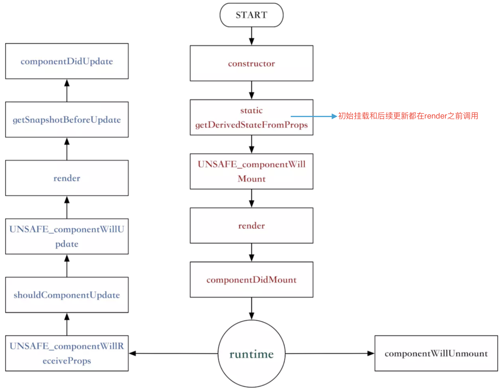

# react16新的周期函数
新增：getDerivedStateFromProps、getSnapshotBeforeUpdate

废弃：componentWillMount、componentWillReceiveProps、componentWillUpdate

React16并没有删除这三个钩子函数，但是不能和新增的两个钩子函数混用。

## 新的生命周期图


## getDerivedStateFromProps
React 16.3中新引入的静态方法，语义化即从props中获取state，功能实际上就是将传入的props映射到state上面。

是一个静态函数，也就是这个函数不能通过this访问到class的属性。

也就是除了两个默认的位置参数 nextProps 和 prevState 以外, 无法访问任何组件上的数据。

> static getDerivedStateFromProps 和 componentWillReceiveProps 的区别？

触发机制：
    
    二者的触发阶段有很大差异，getDerivedStateFromProps 并不是 componentWillReceiveProps 的替代品。
    
    componentWillReceiveProps 在组件接收到新的参数时被触发，所以当父组件导致子组件更新的时候, 即使接收的 props 并没有变化, 这个函数也会被调用。

    getDerivedStateFromProps 无论是父组件的更新, props 的变化, 或是组件内部执行了 setState(), 它都会被调用。

工作方式：
    
    componentWillReceiveProps 组件接收到的新的props与旧的props进行对比，用户需要在函数体中调用 setState() 来更新组件的数据。
    
    getDerivedStateFromProps 组件接收到的新的props，使用时需要在这个函数中返回一个对象, 它将作为 setState() 中的更新组件，需要注意的是，如果props传入的内容不需要影响到你的state，那么就需要返回一个null，这个返回值是必须的，所以尽量将其写到函数的末尾。    
    
> static getDerivedStateFromProps 比 componentWillReceiveProps 有什么优点？    

    当外部多个属性在很短的时间间隔之内多次变化，就会导致componentWillReceiveProps被多次调用。
    
    这个调用并不会被合并，如果这次内容都会触发异步请求，那么可能会导致多个异步请求阻塞。
    
    在使用getDerivedStateFromProps的时候，遇到了上面说的props在很短的时间内多次变化，
    
    而react中大部分的更新过程的触发源都是setState，并且setState会合并，所以render触发的频率并不会非常频繁，也就是触发getDerivedStateFromProps不会很频繁。
    
### 使用例子
从生命周期的更新来看，react更希望getDerivedStateFromProps这个周期函数将受控的props和state进行分离。

#### 例子1
比较常见，从 props 中更新 state，当前组件中没有对这个state(num)进行二次操作。
```js
state = {
    num: 0,
};

static getDerivedStateFromProps(nextProps, prevState) {
    // 只有 props 值和 state 值不同时才更新 state 值
    if(prevState.num !== nextProps.num) {
        // 需要在这个函数中返回一个对象, 它将作为 setState() 中的更新组件
        return {
            num: nextProps.num,
        }
    }

    return null; // 如果props传入的内容不需要影响到你的state，那么就需要返回一个null，这个返回值是必须的，所以尽量将其写到函数的末尾
}

<div style={{width: '100%', height: 100}} >
    {this.state.num}
    <Button onClick={() => this.setState({num: this.state.num + 1})}>按钮</Button>
</div>
```

#### 例子2
虽然是不推荐的，但是也有可能项目中遇到，从 props 中更新 state，但当前组件对这个state(num)进行了二次操作。

如果代码还按例子1那样去写，我们会发现每次点击Button时，this.state.num 不会变。

这是因为内部 state 变化后，又会走 getDerivedStateFromProps 方法，并把 state 值更新为传入的 props。
```js
state = {
    num: 0,
    prevNum: 0,
};

static getDerivedStateFromProps(nextProps, prevState) {
    if(prevState.prevNum !== nextProps.num) {
        return {
            num: nextProps.num,
            prevNum: nextProps.num, // 保存一个之前的 props 值
        }
    }

    return null;
}

<div style={{width: '100%', height: 100}} >
    {this.state.num}
    <Button onClick={() => this.setState({num: this.state.num + 1})}>按钮</Button>
</div>
```
