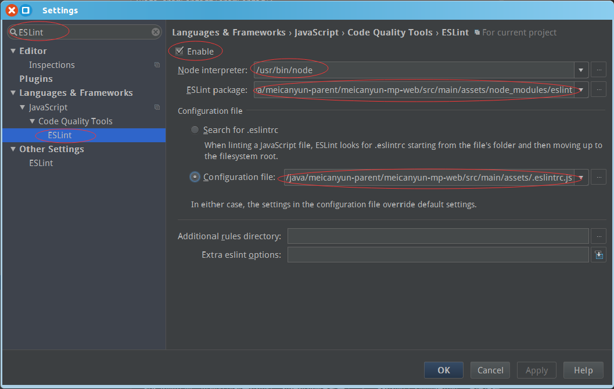

# PC端React编码规范

## 规范目的
为了提高团队开发效率，减少沟通障碍，以及便于后期维护扩展，特制定此规范。本规范一经大家确认，前端开发人员必须按照此规范进行前端开发。规范中如有不恰之处，请及时提出，经讨论后修改或完善此规范。

## 工具
项目中可以使用ESLint，辅助实现规范

IntelliJ IDEA the Java IDE（IntelliJ系列） 配置：

*.eslintrc.js配置文件项目中已经加入，相关包已经安装了，注意第一次使用时`npm install ` eslint相关包*

IDE 左上角 File -> Settings  打开settings，配置如下图



说明：
1. Enable：勾选 启用eslint；
1. Node interpreter：本机node安装目录；
1. ESLint package:：ESLint包，选用项目中 node_moduls 中安装的ESLint包即可；
1. Configuration file： ESLint 配置文件目录，一般项目根目录中有，命名为：`.eslintrc.js`或`.eslintrc`;

## 文件规范
1. 文件夹，文件命名，要使用语义化的英文，不允许使用缩写、数字、中文名，尤其是中文名，会有不同系统电脑兼容性问题，导致无法git clone 或者编译错误。
1. 框架相关文件归档至`src/layouts`；
1. 公共工具方法归档至`src/commons`，注意，这个文件夹存放公共的方法，而非组件，添加之后QQ或邮件通知全体前端开发人员；
1. 公共自定义组件归档至`src/components`，并写好README，QQ或邮件通知全体前端开发人员；
1. 业务模块统一归档至`src/pages`；
1. 一个功能模块新建一个文件夹，一个模块相关的文件（html，css、less，js，jsx，images），归档至对应的模块文件夹中，当此模块不需要时，删除此模块对应的文件夹，即可将此模块相关文件全部移除；
1. 图片个数超过5个以上，要归档至当前模块文件夹下的`imgs/`文件夹中；
1. 文件夹命名：小写英文+连字符（减号），比如：`user-center`；
1. 文件内容如果包含jsx，文件后缀要为`.jsx`；
1. 组件文件命名： 驼峰式命名，首字母大写：比如`UserCenter.jsx`;一个文件一个组件，而且文件名和组件名必须完全一致，默认export 组件名（或者变量名）与文件名完全一致。
1. 添加修改页面，文件名以Edit结尾；列表页面，文件名以List结尾；详情页面以Detail结尾；
  ```
  UserEdit.jsx
  UserDetail.jsx
  UserList.jsx
  ```
1. css/less命名：一个模块下基本就包含一个css/less文件，命名为style.css/style.less即可；
1. 图片：小写英文+连字符（减号），比如：`user-avatar.jpg`
1. 文件之间的依赖，统一使用ES6写法：`import request from 'Xxx.jsx'`；
1. 统一使用ES6得模块写法（`import`,`export`），不要使用其他方式。

## jsx

1. 文件名必须和默认输出完全保持一致
```javascript
// file CheckBox.js or CheckBox.jsx
export default class CheckBox {
  // ...
}
```
1. 引入组件名，要保持和默认导出组件名一直
```
import CheckBox from './CheckBox';
```

1. import必须写在文件的头部，未使用到的引入，要删除。
1. export必须写在文件底部，通过export {aaa,bbb,Ccc as ccc }方式导出多个变量，通过export default aaa 导出默认变量。
1. import各类型文件顺序约定
  - 第三方模块
  - 自定义模块
  - 图片
  - css/less文件
  - 声明模块变量

  比如：
  ```javascript
  //第三方模块
  import React from 'react';
  import {Link} from 'react-router'
  import assign from 'object-assign';
  import moment from 'moment';
  import {   //一次性引入过多，最好使用如下方式，方便增，删
        message,
        Button,
        Row,
        Col,
        Tabs,
        Progress，
 } from 'antd';
  //自定义模块
  import Page from '../../page/Page';
  import ajax from '../../common/ajax'
  //图片
  import UserAvatar from './user-avatar.jpg'
  // css/less文件
  import './style.less';
  // 模块变量
  const TabPane = Tabs.TabPane;
  const ProgressLine = Progress.Line;
  ```
1. 声明引用一个第三方模块的变量，必须使用const
  ```javascript
  const TabPane = Tabs.TabPane;
  const ProgressLine = Progress.Line;
  ```
1. 尽量使用`const`声明变量，其次使用`let`，不允许使用`var`
1. React统一使用ES6写法
  ``` javascript
  class App extends React.Component{
      // 构造函数，如果如下默认形式，可以省略
      constructor(props){
          super(props);
      }
      // 指定props参数规范， 属性,注意前面有static,属于静态方法.
      static propTypes = {
          autoPlay: PropTypes.bool.isRequired
      }
      // 默认props, 注意前面有static,属于静态方法.
      static defaultProps = {
          loading:false
      };
      // 初始化state, 注意前面没有static
      state = {
          showMenu:false
      };
      componentDidMount() {
          // do something yourself...
      }
      // 事件的写法,这里要使用箭头函数,箭头函数不会改变this的指向,否则函数内,this指的就不是当前组件
      handleClick = (e)=>{
          this.setState({...});//这里的this指的还是App
      };
      render(){

      }
  }
  ```
1. jsx类的结构顺序：
  - constructor
  - static propTypes
  - static defaultProps
  - state
  - 其他自定义属性或静态（类）属性
  - 周期函数componentWillMount等
  - 自定义函数handle系列等
  - 其他自定义辅助函数
  - 自定义renderXxx方法等
  - render

  遵循这样的约定，方便快速查找各部分代码。

1. jsx中事件属性，统一on开头，比如
```html
<Sidebar onClick={this.handleClick} onToggle={this.handleToggle}></Sidebar>
```
1. 事件处理函数命名，统一`handle`开头，驼峰式命名，比如：`handleClick` `handleToggle`等
1. 事件统一使用箭头函数，箭头行数不会改变向上文（`this`指向），不必使用`bind`了。
  ```javascript
  handleClick = (e) => {
        // Do something here!
    };
  ```
1. 请求统一使用封装过的ajax

## less/css
1. 每个模块如果只有一个less/css文件，要命名为`style.less/style.css`
1. 类名/id名 小写英文+连字符，比如：`.user-avatar`
1. 编写less时，避免嵌套多层（最多不要超过3层）。不要编写太过于复杂的less。

## 路由结构规范
*特殊情况，不能按照规范实现，与各位leader商榷*
```

多单词使用“_”链接，不要使用“-”，或其他特殊字符。
根据菜单结构，定义url结构，RestFull 约定，具体看下面例子。
```
例如：
菜单结构
```
门店  # store
  -订单 # order 一级
    -外卖订单 # take_out 二级
      -新订单 # new_order 可点击跳转页面
      -所有订单 # all_order 可点击跳转页面
```
对应的菜单为：
```
列表页
http:localhost:8080/store/order/take_out/new_orders
详情页
http:localhost:8080/store/order/take_out/new_orders/12
添加页
http:localhost:8080/store/order/take_out/new_orders/new
修改页
http:localhost:8080/store/order/take_out/new_orders/21/edit
```

