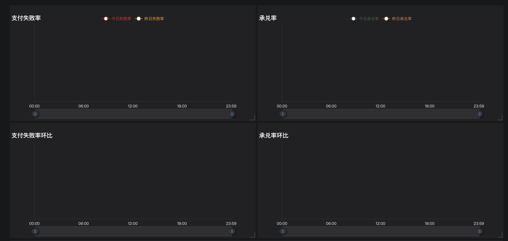

# 拖拽式网格布局
github: https://github.com/Foveluy/Dragact/tree/master/docs

## 安装
```js
yarn add dragact --save
```

## 图片演示


## 项目例子
应用场景：echarts图表或表格的拖拽、缩放及排序。
```js
import {Dragact} from 'dragact';

// 横坐标、纵坐标、挂件布局中宽度比（整数）、挂件布局中高度比（整数）、对应的组件、key唯一标示
const layout = [
   { GridX: 0, GridY: 0, w: 4, h: 2, content: <FailureRingChart1/>, key: '0' },
   { GridX: 0, GridY: 0, w: 4, h: 2, content: <FailureRingChart2/>, key: '1' },
   { GridX: 0, GridY: 0, w: 4, h: 2, content: <FailureRingChart3/>, key: '2' }
];

<Dragact 
    layout={layout} // 必填项 
    col={16} // 必填项 会把容器的宽度平均分为col等份 所有如果一行有两个图表 每个图表的w=8
    width={this.state.clientWidth || 800} // 必填项 可以设置为动态的值
    rowHeight={40} // 必填项 容器内每个元素的最小高度
    margin={[5, 5]} // 必填项 每个元素的margin,[左右, 上下]
    styleName="plant-layout" // 必填项 样式
    onDragStart={this.handleDragStart} // 拖动开始的回调
    onDrag={this.handleDrag} // 拖动中
    onDragEnd={this.handleDragEnd} // 拖动结束的回调
    ref={node => this.layoutBox = node} // 设置ref 然后可以使用其api getLayout()返回d当前最新的layout
>
    // item => layout中的每个元素
    // provided => 可打印看下，包括 isDragging props 等参数
    {(item, provided) => {
        return (
            <div
                {...provided.props}
            >
                {item.content}
                // 拖动手柄 样式
                <span {...provided.dragHandle} styleName="drag-layout"/>
                // 缩放手柄 样式
                <span {...provided.resizeHandle} styleName="resize-layout"/>
            </div>
        )
    }}
</Dragact>

// 项目中可能需要 最后保存 图表的顺序
handleDragEnd = () => {
    // 则可以用上面提到的 获取到组件的ref，getLayout()返回当前的布局。
    console.log(this.layoutBox.getLayout());
    /*
        [
           { GridX: 0, GridY: 0, w: 4, h: 2, content: <FailureRingChart1/>, key: '0' },
           { GridX: 0, GridY: 0, w: 4, h: 2, content: <FailureRingChart3/>, key: '2' },
           { GridX: 0, GridY: 0, w: 4, h: 2, content: <FailureRingChart2/>, key: '1' },
        ]
    */
};
```
